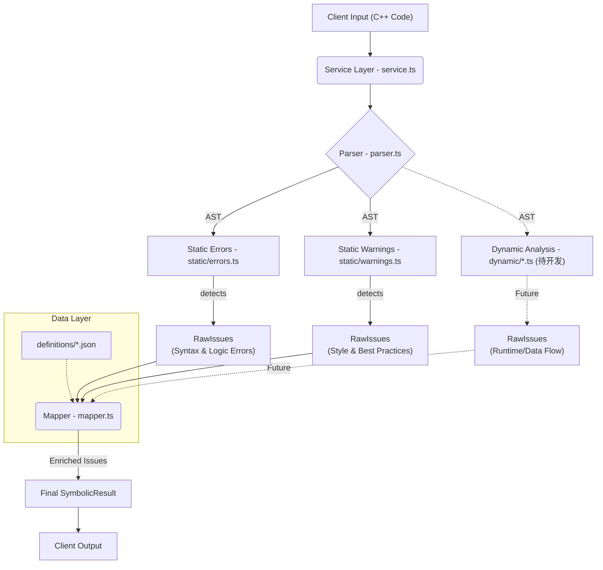

# Symbolic Analysis Engine (符号分析引擎)

本模块是项目的静态分析核心，基于 **Tree-sitter** 和 **SCM (S-expression)** 模式匹配技术构建。它不依赖编译器的完整工具链，而是直接对源代码进行 AST（抽象语法树）分析，旨在为用户提供**即时、教学导向**的代码诊断（错误与警告）。

## 1. 架构与功能简介

当前架构采用了 **Facade（外观模式）** 与 **Pipeline（流水线）** 设计。

### 核心流程图



### 模块职责

1. **Infrastructure (`parser.ts`)**: 基础设施层。
* 负责加载 WebTreeSitter 和 C++ WASM 语言包。
* 维护 Parser 的单例状态。
* 抹平不同环境下的 API 差异。


2. **Static Analysis (`static/`)**: 静态分析层。
* `errors.ts`: 处理**阻断性问题**。包含两步：首先检测 Tree-sitter 原生的语法错误（MISSING/ERROR 节点），然后运行 SCM 规则检测逻辑错误（如数组越界）。
* `warnings.ts`: 处理**建议性问题**。纯 SCM 模式匹配，检测代码风格、命名规范或不推荐的写法（如 goto）。


3. **Dynamic Analysis (`dynamic/`) [规划中]**: 动态/高级扫描层。
* 预留用于处理跨行、跨作用域的复杂分析（如简单的数据流分析、污点分析）。


4. **Transformation (`mapper.ts`)**: 转换层。
* 将分析层产生的 `RawIssue`（仅包含规则 ID 和位置）与 JSON 定义文件结合。
* 执行消息模板插值（例如将 `{name}` 替换为变量名）。
* 输出带有教学建议、修复代码的富文本对象。


5. **Orchestrator (`service.ts`)**: 总调度层。
* 对外暴露统一入口。
* 并行调度 Error 和 Warning 分析任务。
* 聚合结果并附加性能元数据。


---

## 2. 各文件对外 API 接口

以下是各子模块供内部互相调用的 API：

### `parser.ts`

* `parseCode(sourceCode: string): Promise<Tree>`: 解析代码生成 AST。
* `getParser(): Promise<Parser>`: 获取底层 Parser 实例。
* `createQuery(language: Language, source: string): Query`: 创建 SCM 查询对象（兼容性封装）。

### `static/errors.ts`

* `analyzeErrors(tree: Tree): Promise<RawIssue[]>`: 对 AST 进行全量错误扫描（原生 + SCM）。

### `static/warnings.ts`

* `analyzeWarnings(tree: Tree): Promise<RawIssue[]>`: 对 AST 进行全量警告扫描（仅 SCM）。

### `mapper.ts`

* `mapIssues(rawErrors: RawIssue[], rawWarnings: RawIssue[]): { errors: Issue[], warnings: Issue[] }`: 将原始数据转换为完整 Issue 对象。

---

## 3. 对外提供的 API 接口 (Service Layer)

外部模块（如 Next.js API Route 或 Server Actions）仅需引用 `service.ts`。

### 核心方法

```typescript
import { analyzeCode, SymbolicResult } from "@/src/server/model/symbolic/service";

/**
 * 执行符号分析
 * @param sourceCode - 待分析的 C++ 源代码字符串
 * @returns Promise<SymbolicResult> - 包含错误、警告和元数据的分析结果
 */
function analyzeCode(sourceCode: string): Promise<SymbolicResult>;

```

### 返回类型定义

```typescript
interface SymbolicResult {
  errors: Issue[];      // 严重错误列表
  warnings: Issue[];    // 警告建议列表
  metadata?: {
    parseTime?: number; // 解析耗时 (ms)
    nodeCount?: number; // AST 节点数量
  };
}

```

---

## 4. 调用示例与预期输出

### 输入 (Input)

```typescript
const code = `
  void main() {
    int arr[-5];      // 逻辑错误：数组大小为负
    int a = ;         // 语法错误：缺少表达式
    goto label;       // 警告：使用 goto
  }
`;

const result = await analyzeCode(code);

```

### 预期输出 (Output JSON)

```json
{
  "errors": [
    {
      "ruleId": "CPP_SYNTAX_ERROR",
      "severity": "High",
      "display_name": "Syntax Error",
      "message": "Compilation failed. Check for missing expressions or symbols.",
      "location": { "line": 3, "column": 12 },
      "meta": { "token": ";" }
    },
    {
      "ruleId": "CPP_INVALID_ARRAY_SIZE",
      "severity": "High",
      "display_name": "Invalid Array Size",
      "message": "Array size cannot be negative. You provided: -5.",
      "remediation": "Ensure the array size is a positive integer.",
      "location": { "line": 2, "column": 8 },
      "meta": { "size": "-5" }
    }
  ],
  "warnings": [
    {
      "ruleId": "CPP_NO_GOTO",
      "severity": "Low",
      "display_name": "Avoid Goto",
      "message": "Usage of 'goto' breaks structured programming principles.",
      "pedagogical_label": "Best Practice",
      "location": { "line": 4, "column": 4 }
    }
  ],
  "metadata": {
    "parseTime": 12.5,
    "nodeCount": 45
  }
}

```

---

## 5. 扩展指南：构建规则库

接下来的重点工作是丰富规则库。我们需要在 `data/symbolic` 目录下扩展定义。

### (1) 文件格式要求

#### A. SCM 模式文件 (`.scm`)

存放于 `data/symbolic/ast-patterns/cpp/{errors|warnings}/`。

* **命名**: 必须与 Rule ID 一致，例如 `CPP_DIV_BY_ZERO.scm`。
* **语法**: Tree-sitter S-expression。
* **捕获约定**:
* `@target`: **必须存在**。标记报错的主要节点（用于高亮位置）。
* `@name`, `@val` 等: 可选。提取代码中的具体文本，用于 JSON 消息模板的变量替换。


**示例 (CPP_INVALID_ARRAY_SIZE.scm):**

```scheme
(array_declarator
  size: (number_literal) @size  ; 捕获具体的数值，赋值给 @size
  (#match? @size "^-")          ; 谓词：匹配负号开头
) @target                       ; 标记整个声明节点为报错目标

```

#### B. JSON 定义文件 (`.json`)

存放于 `data/symbolic/definitions/`，主要为 `cpp-errors.json` 和 `cpp-warnings.json`。

* **结构**: Key 为 Rule ID，Value 为定义对象。
* **模板插值**: `message` 字段支持 `{variable}` 语法，变量名需与 SCM 中的捕获名一致。

**示例 (cpp-errors.json):**

```json
{
  "CPP_INVALID_ARRAY_SIZE": {
    "severity": "High",
    "display_name": "Invalid Array Size",
    "message": "Array size cannot be negative. You provided: {size}.", 
    "pedagogical_label": "Memory Safety", （教育视角标签）
    "knowledge_concept": "Arrays",
    "remediation": "Use a positive integer literal or constant.",
    "remediation_code": "int arr[10];" （修复代码-若依赖上下文则不写）
  }
}

```

### (2) 内容构建思路

为了构建一个全面的教学型分析引擎，建议按以下维度扩展规则：

#### Errors (errors.ts)

重点关注**编译器报错信息晦涩**或**编译器通过但运行时崩溃**的场景。

1. **初学者常见语法坑**:
* `CPP_ASSIGNMENT_IN_IF`: `if (a = 1)` (混淆赋值与比较)。
* `CPP_MISSING_SEMICOLON`: 尝试增强原生检测，识别特定上下文的缺分号。


2. **运行时逻辑错误 (Undefined Behavior)**:
* `CPP_DIV_BY_ZERO`: 除数为 0（字面量检测）。
* `CPP_ARRAY_INDEX_OOB`: 数组越界（针对静态大小数组）。
* `CPP_USE_BEFORE_INIT`: 变量未初始化即使用（简单的局部变量分析）。


3. **类型错误**:
* `CPP_NARROWING_CONVERSION`: 浮点数直接赋给整数。


#### Warnings (warnings.ts)

重点关注**代码风格**、**现代 C++ 规范**和**可维护性**。

1. **命名规范**:
* `CPP_VAR_NAMING`: 变量名过短（如单个字母除 `i,j,k,x,y,z` 外）或全大写（非宏）。


2. **过时/危险特性**:
* `CPP_NO_GOTO`: 禁止使用 `goto`。
* `CPP_GLOBAL_VARIABLE`: 滥用非 const 全局变量。
* `CPP_C_STYLE_CAST`: 建议使用 `static_cast` 而非 `(int)x`。


3. **代码复杂度**:
* `CPP_DEEP_NESTING`: `if/for` 嵌套层级过深 (> 3层)。


4. **最佳实践**:
* `CPP_EMPTY_BLOCK`: 空的 `if` 或 `while` 块。
* `CPP_MAGIC_NUMBER`: 代码中出现裸露的数字字面量（建议定义常量）。

---

## 6. 测试指令

自定义测试：symbolic.ts - 开头有指令说明

测试全部：
```bash
npm test
```

分别测试parser, mapper, errors, warnings, service：
```bash
npm test -- tests/server/model/symbolic/parser.test.ts
npm test -- tests/server/model/symbolic/mapper.test.ts
npm test -- tests/server/model/symbolic/static/errors.test.ts
npm test -- tests/server/model/symbolic/static/warnings.test.ts
npm test -- tests/server/model/symbolic/service.test.ts
```