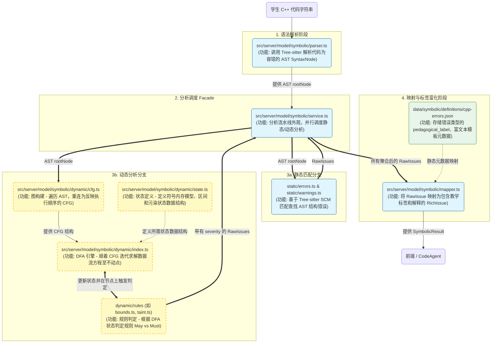

# 动态数据流分析引擎 (DFA Solver) 核心架构与执行流解析

本引擎的设计理论基础为**抽象解释**。引擎不执行具体的物理计算，而是基于抽象的数学状态集合（如区间格），在**控制流图**（CFG）上进行不动点迭代，以此推演出代码在所有可能执行路径下的极值边界与内存状态，从而实现针对越界、除零等漏洞的安全验证。

引擎的分析流水线采用高度解耦的模块化设计：系统首先将抽象语法树（AST）转化为具有拓扑逻辑的有向图；随后，核心求解器携带定义了变量状态的符号环境（Symbolic Environment），在控制流图上执行状态转移与分支约束收敛；最终，通过事件驱动机制触发独立的诊断插件（Checkers），完成具体的安全审计任务。

以下是动态分析模块（`dynamic/`）内五大核心文件的架构定位与协同机制：

### 1. `index.ts`：系统门面与异常隔离层，作为外部调用动态流分析的唯一统一接口
* **实现逻辑**：
负责全局分析的生命周期编排。它接收语法树后，依次触发构图、造引擎和启动推演。同时它套用了一个巨大的容错保护壳，确保不管遇到多么极端的 AST 或推演死循环，都会安全返回兜底结果，绝不导致服务端崩溃。
* **主要函数及其功能**：
`analyzeDataFlow(tree)`：系统唯一入口函数，负责串联 `buildCFG` 和 `engine.run()`，并包含顶级的 `try-catch` 故障隔离机制。

### 2. `cfg.ts`：控制流图构建器，将一维的 AST 转化为适用于数据流分析的有向图拓扑结构
* **实现逻辑**：
由于代码如果是一维字符串将无法进行分支分析，该模块负责遍历 AST，识别出所有 `if-else` 分岔路、`while/for` 循环回边以及 `break/return` 等非线性跳转指令。最终将代码切分为一个个“基本块（Basic Block）”并用有向边连接起来。
* **主要函数及其功能**：
`buildCFG(tree)`：控制流图的构建入口，初始化图数据并最终返回完整的控制流图（含 entry 和 exit 节点）。
`processStatement(node, currentBlock)`：递归处理各个代码节点的流转核心。根据节点类型判断是该塞入当前代码块，还是该拉出一条新的分支线。

### 3. `state.ts`：符号状态与区间格模型，定义了引擎在执行图遍历时所携带的抽象内存账本与数学结构
* **实现逻辑**：
引擎不记录变量具体的死值（如 `i = 5`），而是使用区间上下界（如 `i = [0, 5]`）来记录所有可能值的极限范围。同时它追踪变量是否未初始化、是否被输入污染等生命周期状态。在多条控制流路径汇聚时，它会执行保守的最坏情况合并。
* **主要函数及其功能**：
`Interval.union(other)`：区间并集运算。用于处理分支汇聚时不同路径的极值合并。
`Interval.intersect(other)`：区间交集运算。配合引擎，在进入特定条件分支时进行精确的极值裁剪。
`Environment.merge(other)`：环境状态汇聚。将多条路径的变量区间、初始化状态进行整体的最保守聚合。

### 4. `engine.ts`：核心求解器与推演中枢，在 CFG 上驱动状态转移并进行不动点迭代求解
* **实现逻辑**：
携带 `state.ts` 生成的环境账本，顺着 `cfg.ts` 构建的地图游走。遇到运算则做区间算术，遇到条件分支则根据 `if/while` 条件缩小变量范围。遇到可能死循环的节点则触发“加宽（Widening）”强行推向无穷大以结束推演。每行代码推演完，主动拍醒检查器去查错。
* **主要函数及其功能**：
`run()`：引擎主循环。利用工作表（Worklist）算法不断遍历基本块，直到所有状态收敛（不动点）。
`refineBranchState(...)`：智能分支剪枝。利用 `if` 判断里的逻辑约束，反向收敛其中变量的取值区间。
`evaluateExpression(...)`：表达式推演器。递归求解运算表达式最终可能的极限区间。
`transferStatement(...)`：语句状态转移。捕获变量声明、赋值以及 `++` 等副作用，实时更新当前账本。

### 5. `checkers/` (如 `array_bounds.ts`)：漏洞诊断插件层，实现特定安全规则诊断的独立校验器模块

#### `index.ts`：动态分析规则注册中心与接口定义层，作为所有诊断规则的统一挂载点
* **实现逻辑**：
它是一个纯粹的管理枢纽。首先它定义了所有检查器必须遵守的契约（即必须包含接收 AST 节点和环境账本的 `check` 函数）。其次，它维护了一个全局的规则数组，引擎在每执行完一行代码后，只需遍历这个数组，就能唤醒所有已激活的规则插件。后续组员写完新规则，只需在这里 `import` 并推入数组即可生效。
* **主要模块及其功能**：
`interface Checker`：契约接口。强制要求所有扩展的插件必须实现 `check(node, env)` 方法。
`ALL_CHECKERS`：全局规则挂载数组。引擎读取此数组来逐一触发缺陷扫描。

#### 例`array_bounds.ts`：数组内存边界检查器，负责在运行时动态捕捉 C++ 中的数组越界漏洞
* **实现逻辑**：
采用观察者模式。它只拦截语法树中的“数组下标访问操作（如 `arr[i]`）”。一旦发现该操作，它会立刻进行多维解包提取出真实的数组名，然后向引擎的环境账本索要该数组的合法长度区间，以及此时此刻下标 `i` 的推演极值区间。最后进行数学交集比对：如果推演区间完全落在合法范围外，则定性为必然越界（Must-Issue）；如果有交集但也覆盖了非法区域，则定性为疑似越界（May-Issue）。
* **主要函数及其功能**：
`ArrayBoundsChecker.check(node, env)`：诊断主函数。执行节点过滤、多维数组解包、向环境查账，并最终依据数学比对结果发射缺陷报告。
`evaluateIndexExpression(node, env)`：局部推演工具。无视复杂的 AST 包装，通过递归推演算术运算，将访问下标表达式还原为底层的数学区间。

---
系统采取了**统一解析 -> 双轨分析 -> 聚合富化 -> 标准输出**的现代化编译器流水线架构。
