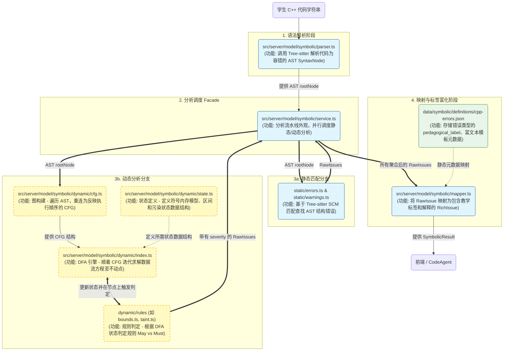

```mermaid
graph TD
    %% 定义全局风格：蓝色代表已有基建，黄色代表需要攻克的硬核实现，绿色代表数据定义，紫色代表输出
    classDef existing fill:#e1f5fe,stroke:#01579b,stroke-width:1px,rx:5,ry:5;
    classDef hardcode fill:#fff9c4,stroke:#fbc02d,stroke-width:2px,stroke-dasharray: 5 5,rx:5,ry:5;
    classDef data fill:#e8f5e9,stroke:#2e7d32,stroke-width:1px,rx:5,ry:5;
    classDef output fill:#f3e5f5,stroke:#7b1fa2,stroke-width:1px,rx:5,ry:5;

    %% 整个流程的输入
    InputCode(学生 C++ 代码字符串) --> parser_ts;

    %% --- 1. 语法解析阶段 (已有基建) ---
    %% 该阶段将纯文本代码转为 Tree-sitter AST
    subgraph Subgraph_Parser [1. 语法解析阶段]
        direction TB
        parser_ts("src/server/model/symbolic/parser.ts
(功能: 调用 Tree-sitter 解析代码为容错的 AST SyntaxNode)"):::existing;
    end
    parser_ts -->|提供 AST rootNode| service_ts;

    %% --- 2. 分析调度Facade (已有基建) ---
    %% 负责解耦，串联整个分析流程
    subgraph Subgraph_Facade [2. 分析调度 Facade]
        direction TB
        service_ts("src/server/model/symbolic/service.ts
(功能: 分析流水线外观，并行调度静态/动态分析)"):::existing;
    end

    %% 并行调度两条分支：静态模式匹配 vs 动态符号执行
    service_ts ==>|AST rootNode| static_analyzers;
    service_ts ==>|AST rootNode| dynamic_cfg_ts;

    %% --- 3a. 静态匹配分支 (原有逻辑) ---
    %% 处理纯结构性错误，无需图结构
    subgraph Subgraph_Static [3a. 静态匹配分支]
        direction TB
        static_analyzers("static/errors.ts & static/warnings.ts
(功能: 基于 Tree-sitter SCM 匹配查找 AST 结构错误)"):::existing;
    end

    %% --- 3b. 动态符号分析分支 (你需要攻克的核心 Hard code) ---
    %% 核心突破点：引入 CFG 和 DFA。这里的分析判定包含了 May(Medium) vs Must(High)
    subgraph Subgraph_Dynamic [3b. 动态分析分支]
        direction TB
        
        dynamic_cfg_ts("src/server/model/symbolic/dynamic/cfg.ts
(功能: 图构建 - 遍历 AST，重连为反映执行顺序的 CFG)"):::hardcode;
        
        dynamic_state_ts("src/server/model/symbolic/dynamic/state.ts
(功能: 状态定义 - 定义符号内存模型、区间和污染状态数据结构)"):::hardcode;
        
        dynamic_analyzer_ts("src/server/model/symbolic/dynamic/index.ts
(功能: DFA 引擎 - 顺着 CFG 迭代求解数据流方程至不动点)"):::hardcode;
        
        dynamic_rules_ts("dynamic/rules (如 bounds.ts, taint.ts)
(功能: 规则判定 - 根据 DFA 状态判定规则 May vs Must)"):::hardcode;

        %% 动态分支内部流转
        dynamic_cfg_ts -->|提供 CFG 结构| dynamic_analyzer_ts;
        dynamic_state_ts -.->|定义所需状态数据结构| dynamic_analyzer_ts;
        dynamic_analyzer_ts <==>|更新状态并在节点上触发判定| dynamic_rules_ts;
    end

    %% 汇聚 RawIssue
    static_analyzers ==>|RawIssues| service_ts;
    dynamic_rules_ts ==>|带有 severity 的 RawIssues| service_ts;

    %% --- 4. 映射与标签富化 (原有逻辑) ---
    %% 统一处理严重程度和富文本标签
    subgraph Subgraph_Mapper [4. 映射与标签富化阶段]
        direction TB
        service_ts ==>|所有聚合后的 RawIssues| mapper_ts;
        
        data_definitions("data/symbolic/definitions/cpp-errors.json
(功能: 存储错误类型的 pedagogical_label、富文本模板元数据)"):::data;
        
        mapper_ts("src/server/model/symbolic/mapper.ts
(功能: 将 RawIssue 映射为包含教学标签和解释的 RichIssue)"):::existing;
        
        data_definitions -.->|静态元数据映射| mapper_ts;
    end

    %% --- 5. 最终输出 ---
    mapper_ts -->|提供 SymbolicResult| FinalOutput(前端 / CodeAgent);

```